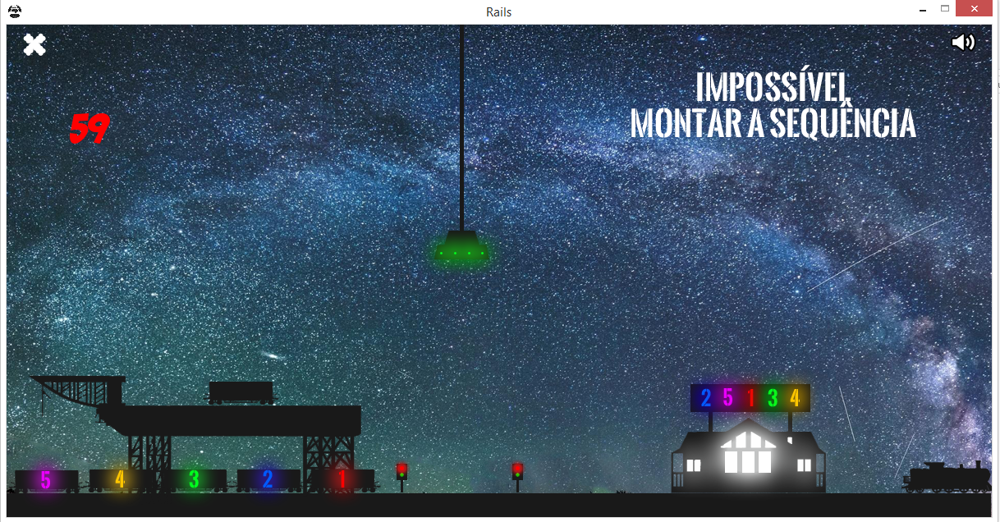

# Tra1n



## Project

- It was developed as a partial grade to the Data Structure class, Computer Science at UFSCar;
- It was the second one of 3 games;
- It's a Stack+Queue application (play the game and try to find it!);
- It participated of the [ED Games](http://edgames.dc.ufscar.br/) competition;
- It was awarded on the category "Stack Application" at [ED Games 2015](http://edgames.dc.ufscar.br/games2015.htm);

- It's the **"gamification"** of the [URI Judge Online 1062, Rails](https://www.urionlinejudge.com.br/judge/en/problems/view/1062). This problem is worthy solving, but it's not a requirement to play this game!

## Authors
- Antonio Carlos Falcão Petri
- José Antônio dos Santos Júnior
- José Vitor de Carvalho Aquino
- Tiago Bonadio Badoco

All of them are Computer Science students at [UFSCar, São Carlos](http://ufscar.br/).

## Allegro

"Allegro 4 and Allegro 5 are cross-platform, libraries mainly aimed at video game and multimedia programming. They handle common, low-level tasks such as creating windows, accepting user input, loading data, drawing images, playing sounds, etc. and generally abstracting away the underlying platform. However, Allegro is not a game engine: you are free to design and structure your program as you like.", [Allegro's Introduction page](http://liballeg.org/readme.html).

## Compiling

We will need to install [Allegro 5](http://liballeg.org/) and it's addons. Consult a search engine to see if it's available at your distribution repository.

It's also necessary to install [PhysFS/PhysicsFS](http://icculus.org/physfs/). It will be used to load the game's data dependencies from a zipped file, at `bin/data.dat`.

At [Fedora](https://wiki.allegro.cc/index.php?title=Fedora_and_Allegro_5) (13 <= version <= 21):

```shell
$ sudo yum install allegro5-devel allegro5-addon-acodec-devel allegro5-addon-audio-devel allegro5-addon-dialog-devel allegro5-addon-image-devel allegro5-addon-physfs-devel allegro5-addon-ttf-devel

$ sudo yum install physfs
```

At [Fedora](https://wiki.allegro.cc/index.php?title=Fedora_and_Allegro_5) (version >= 22):

```shell
$ sudo dnf install allegro5-devel allegro5-addon-acodec-devel allegro5-addon-audio-devel allegro5-addon-dialog-devel allegro5-addon-image-devel allegro5-addon-physfs-devel allegro5-addon-ttf-devel

$ sudo dnf install physfs
```

Install `make` if you don't have it yet.

Clone this repository with:

```shell
$ git clone https://github.com/falcaopetri/tra1n.git

$ cd tra1n
```


And compile it with `make`:

`$ make`

### Playing
After compiling, just run the executable at `bin/` folder:

```shell
$ ./bin/Tra1n
```

## Repo Goals

The semester is over (for a little while, by now) and we won't be trying to improve this game.

Developing a game with a low level library (without all the game engine's magic), trying to build up a Software/Game Architecture, and using our recently learned Data Structures knowledge  formed a really great experience though.

So, this repository just aims to share our game and its source code. Hopefully, it will be helpful for someone, maybe some Data Structure student.

If you've got any questions, suggestions or comments, we will gladly help you.

## TODO

- [x] README
- [x] Convert documentation
- [ ] Comments
- [ ] How to manage data.dat (zipped file)?
    - Tmp fix: versioning
